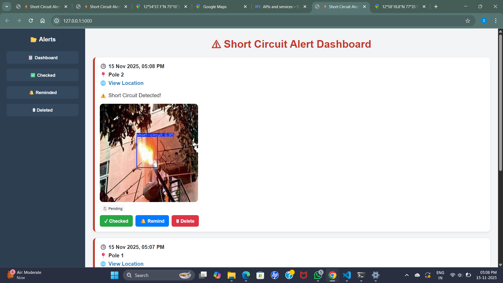
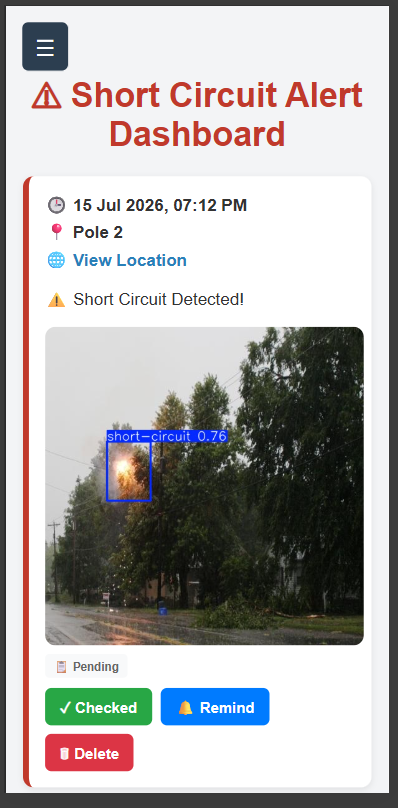
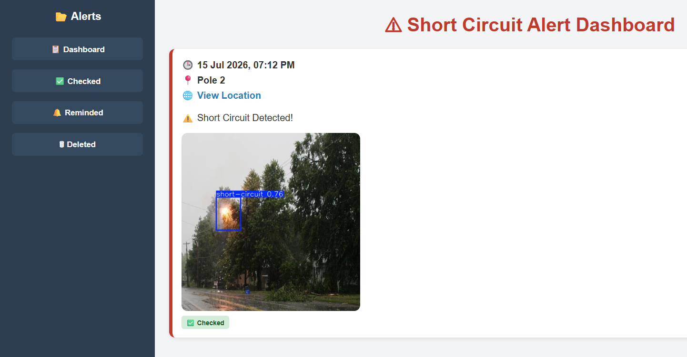
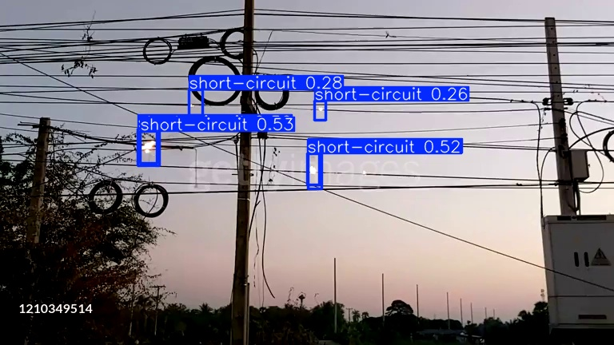
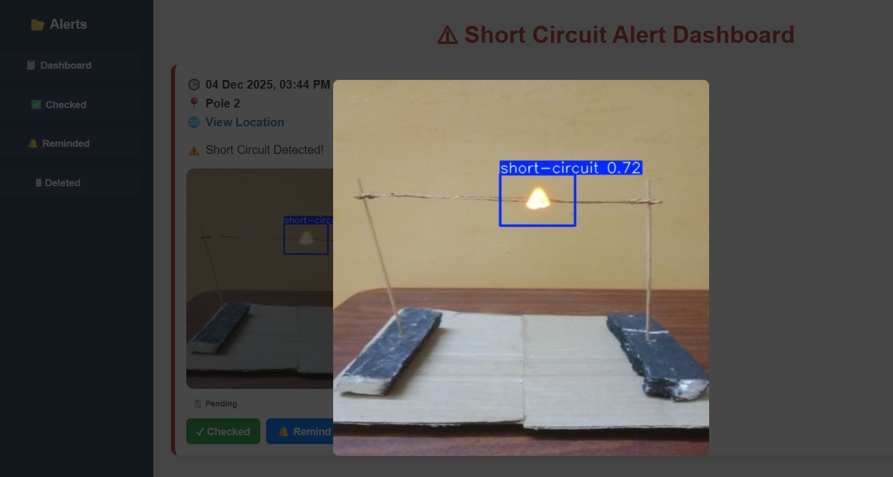

# ⚡ AI-Based Real-Time Short Circuit Detection and Lineman Alert System

An AI-powered real-time monitoring system that detects **short-circuit sparks on electrical distribution lines** using **YOLOv11** and **OpenCV**. The system captures the detected fault image, retrieves location details, and instantly sends alerts to a **mobile-friendly Flask dashboard**, helping linemen respond faster and improve electrical safety.

🏆 **1st Place Winner – Mini Project Expo**

---

## 📌 Project Overview

Traditional short-circuit fault detection requires linemen to manually inspect multiple electrical poles, making the process time-consuming, inefficient, and hazardous.

This project introduces an **AI-based vision system** that continuously monitors electrical lines through a webcam. When a short circuit is detected, the system automatically:

- Detects the short circuit in real time.
- Captures the detected image.
- Retrieves the location details.
- Sends an instant alert to a mobile-friendly dashboard.
- Stores the detected event for future reference.

The proposed system reduces manual inspection, improves response time, and enhances the safety of maintenance personnel.

---

## 🚀 Features

- Real-time short circuit detection using YOLOv11
- Live webcam monitoring
- Automatic image capture upon detection
- Location-based fault reporting
- Mobile-friendly Flask dashboard
- Event logging with timestamp
- Real-time alert generation
- Lightweight and low-cost deployment
- Sensor-free vision-based fault detection

---

## 🛠 Technologies Used

| Category | Technologies |
|----------|--------------|
| Programming Language | Python |
| AI Model | YOLOv11 |
| Deep Learning | PyTorch (Ultralytics) |
| Image Processing | OpenCV |
| Backend | Flask |
| Frontend | HTML, CSS, JavaScript |
| Dataset Annotation | Roboflow, Label Studio |
| Version Control | Git, GitHub |

---

## 📂 Project Structure

```text
AI-Based-Short-Circuit-Detection-and-Lineman-Alert-System/
│
├── app.py
├── train.py
├── predict.py
├── dataset_custom.yaml
├── requirements.txt
├── README.md
├── shortCircuit.mp4
│
├── model/
│   └── yolov11_custom.pt
│
├── templates/
│
├── train/
│   ├── images/
│   └── labels/
│
├── val/
│   ├── images/
│   └── labels/
│
├── screenshots/
│
└── docs/
```

---

# ⚙️ Installation

Clone the repository

```bash
git clone https://github.com/sudeeksha0412/AI-Based-Short-Circuit-Detection-and-Lineman-Alert-System.git
```

Move into the project folder

```bash
cd AI-Based-Short-Circuit-Detection-and-Lineman-Alert-System
```

Create virtual environment

```bash
python -m venv venv
```

Activate virtual environment

Windows

```bash
venv\Scripts\activate
```

Install dependencies

```bash
pip install -r requirements.txt
```

---

# ▶️ Running the Application

Start the Flask application

```bash
python app.py
```

Open your browser

```
http://127.0.0.1:5000
```

Allow webcam access when prompted.

---

# 🧠 Model Information

| Parameter | Value |
|------------|--------|
| Model | YOLOv11 |
| Framework | PyTorch (Ultralytics) |
| Dataset | Custom Short Circuit Dataset |
| Training Epochs | 100 |
| Image Size | 640 × 640 |
| Confidence Threshold | 0.6 |
| Optimizer | SGD with Momentum |
| Image Processing | OpenCV |
| Backend | Flask |

---

# 📊 Dataset

A custom dataset was created specifically for short-circuit detection.

### Dataset Preparation

- Images collected from real and simulated short-circuit scenarios
- Annotated using **Roboflow** and **Label Studio**
- Converted into YOLO format
- Split into Training and Validation datasets

The dataset contains images of:

- Electrical sparks
- Short-circuit flashes
- Smoke
- Normal electrical conditions

---

# 🔄 System Workflow

```text
Live Webcam
      │
      ▼
Image Acquisition
      │
      ▼
YOLOv11 Detection
      │
      ▼
Short Circuit Detected?
      │
 ┌────┴────┐
 │         │
No        Yes
 │         │
 │    Capture Image
 │         │
 │         ▼
 │   Get Location
 │         │
 │         ▼
 │  Generate Alert
 │         │
 │         ▼
 │ Flask Dashboard
 │         │
 └────────►Event Logging
```

---

# 📸 Screenshots

## Dashboard


---

## Mobile Responsive dashboard



---
## checked options for Lineman response



---
## Short Circuit Detection


---
## Real time demo Short Circuit Detection


---


# 🎯 Applications

- Electrical Power Distribution
- Smart Grid Monitoring
- Industrial Power Networks
- Rural Electrification
- Electrical Maintenance
- AI-based Fault Monitoring

---

# 🔮 Future Enhancements

- Night Vision Camera Support
- Thermal Camera Integration
- IoT Sensor Integration
- Mobile Application
- SMS & Email Alerts
- Cloud Deployment
- Predictive Maintenance
- Multi-Fault Detection
- Analytics Dashboard

---

# 🏆 Achievement

🥇 **Secured 1st Place in Mini Project Expo**

This project was recognized for its innovation in applying Artificial Intelligence to real-time electrical fault detection and improving lineman safety through automated alert generation.

---


- **Guide: Geethalaxmi**
# 👩‍💻 Team Members
- **Sudeeksha**
- **Shweta Naik**
- **Sinchana C K**
- **Swasthi H Achar**

Department of Information Science and Engineering

Canara Engineering College, Mangaluru

---

# 📄 License

This project is developed for educational and research purposes.

---

## ⭐ Support

If you found this project useful, consider giving it a **Star ⭐** on GitHub.
